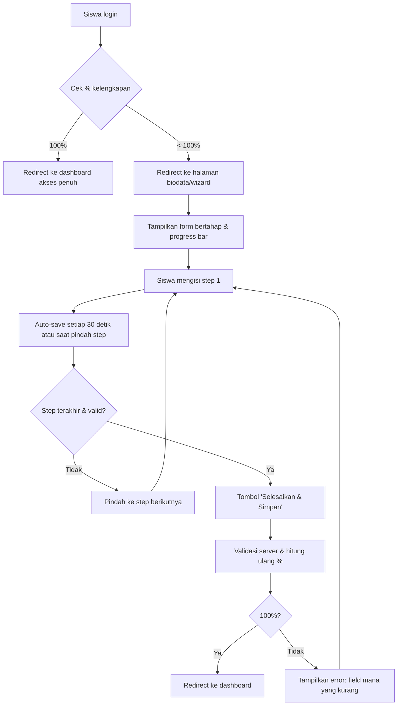

Baik, jika ini adalah **syarat mutlak untuk pendaftaran siswa baru** (tidak ada toleransi akses sebelum biodata 100%), maka metode **redirect paksa** yang Anda rancang sebenarnya sudah tepat dan efektif. Namun, kita tetap bisa menyempurnakannya agar lebih baik dari segi **pengalaman pengguna (UX)** dan **kejelasan proses**, tanpa mengurangi ketegasan aturan.

Berikut adalah **rancangan terstruktur** dengan pendekatan yang lebih baik dari redirect paksa biasa, namun tetap mempertahankan prinsip "mutlak 100%".

---

# Rancangan Alternatif untuk Syarat Mutlak Pendaftaran Siswa Baru

## 1. Prinsip Utama (Tidak Berubah)

> Siswa **sama sekali tidak boleh mengakses** halaman selain halaman biodata (dan logout) sebelum persentase kelengkapan biodata mencapai 100%.

Namun, kita akan menambahkan:
- **Alur wizard bertahap** (step-by-step) agar siswa tidak kewalahan.
- **Penyimpanan otomatis (auto-save)** untuk mencegah kehilangan data.
- **Pesan yang jelas** tentang apa yang kurang dan manfaat mengisi 100%.
- **Kemungkinan logout kapan saja** tanpa kehilangan data yang sudah diisi.

---

## 2. Perbandingan Metode (Dalam Konteks Syarat Mutlak)

| Metode | Paksaan | UX | Rekomendasi untuk Mutlak |
|--------|---------|-----|---------------------------|
| Redirect paksa biasa | ✅ Kuat | ❌ Buruk (tiba-tiba diblokir) | Cukup, tapi bisa ditingkatkan |
| **Redirect + Wizard + Auto-save** | ✅ Kuat | ✅ Baik (jelas & terarah) | **Sangat direkomendasikan** |
| Soft block | ❌ Tidak memenuhi syarat mutlak | ✅ Baik | Tidak boleh dipakai |
| Two-stage | ❌ Tidak memenuhi syarat mutlak | ✅ Baik | Tidak boleh dipakai |

Kesimpulan: **Redirect paksa tetap digunakan, tetapi halaman biodata dibuat lebih ramah dan memandu**.

---

## 3. Rancangan Detail: Redirect Paksa + Wizard + Auto-save

### 3.1 Alur Sistem (Lengkap)



### 3.2 Komponen yang Ditambahkan pada Halaman Biodata

| Komponen | Fungsi | Teknologi |
|----------|--------|------------|
| **Progress bar** | Menunjukkan persentase saat ini dan target 100% | HTML/CSS + JS |
| **Wizard steps** | Membagi 15 field menjadi 3-4 kelompok logis (misal: Data Pribadi, Data Orang Tua, Alamat, Dokumen) | JS (tab atau multi-form) |
| **Auto-save** | Menyimpan setiap perubahan ke server tanpa perlu klik tombol simpan | Fetch API setiap 30 detik |
| **Indikator field wajib** | Field yang belum diisi ditandai dengan warna merah dan ikon peringatan | CSS + validasi JS |
| **Tombol "Simpan & Lanjutkan nanti"** | Memungkinkan siswa logout dan login lagi tanpa kehilangan data | Form submit biasa |
| **Tombol "Logout"** | Tetap tersedia, tanpa redirect paksa (telah dikecualikan di filter) | Route biasa |

### 3.3 Modifikasi Filter SiswaFilter (Tetap Sederhana)

```php
// app/Http/Middleware/SiswaFilter.php
public function handle($request, Closure $next)
{
    $siswa = auth()->guard('siswa')->user();
    if (!$siswa) return redirect('/login');
    
    $percentage = $siswa->calculateCompletionPercentage();
    
    // Route yang diizinkan meskipun < 100%
    $allowedRoutes = [
        'siswa.biodata',           // halaman form
        'siswa.biodata.store',     // simpan data
        'siswa.biodata.auto-save', // endpoint auto-save
        'siswa.logout'
    ];
    
    if (in_array($request->route()->getName(), $allowedRoutes)) {
        return $next($request);
    }
    
    // Selain itu, jika belum 100%, redirect ke biodata
    if ($percentage < 100) {
        return redirect()->route('siswa.biodata')
            ->with('warning', 'Lengkapi biodata hingga 100% untuk mengakses fitur lain.');
    }
    
    return $next($request);
}
```

### 3.4 Tampilan Halaman Biodata (Wireframe)

```
+--------------------------------------------------+
|  Logo        Selamat datang, [Nama]   [Logout]  |
+--------------------------------------------------+
|  Progress: 60% lengkap (9 dari 15 field)        |
|  [=============>     ]                           |
|                                                  |
|  Langkah 2 dari 4: Data Orang Tua               |
|  +--------------------------------------------+ |
|  | Nama Ayah: [____________] (wajib)          | |
|  | Nama Ibu:  [____________] (wajib)          | |
|  | Pekerjaan Ayah: [________]                 | |
|  | Pekerjaan Ibu:  [________]                 | |
|  +--------------------------------------------+ |
|                                                  |
|  [< Sebelumnya]  [Selanjutnya >]   [Simpan]     |
|                                                  |
|  * Field yang belum diisi akan diberi tanda merah|
+--------------------------------------------------+
```

### 3.5 Perhitungan Persentase (Update)

Karena syarat mutlak untuk pendaftaran, pastikan `calculateCompletionPercentage()` mencakup **semua data yang benar-benar diperlukan**. Jika upload berkas fisik (KK, Akte) adalah wajib, maka harus dimasukkan dalam hitungan.

Contoh perhitungan yang lebih baik:

```php
public function calculateCompletionPercentage()
{
    $totalFields = 15; // teks
    $filled = 0;
    foreach ($this->requiredTextFields as $field) {
        if (!empty($this->$field)) $filled++;
    }
    
    // Tambahkan bobot untuk upload berkas jika diperlukan
    $documentFields = ['kk_path', 'akte_path', 'ijazah_path'];
    $totalDocuments = count($documentFields);
    $uploaded = 0;
    foreach ($documentFields as $doc) {
        if (!empty($this->$doc)) $uploaded++;
    }
    
    // Bobot 70% teks, 30% dokumen (sesuaikan)
    $percentage = (($filled / $totalFields) * 70) + (($uploaded / $totalDocuments) * 30);
    return (int) round($percentage);
}
```

**Atau** jika dokumen belum diwajibkan, tetap gunakan 100% dari teks saja, tetapi dokumentasikan ke tim bahwa itu keputusan sementara.

---

## 4. Kelebihan Alternatif Ini Dibanding Redirect Paksa Biasa

| Aspek | Redirect Paksa Biasa | Redirect + Wizard + Auto-save |
|-------|----------------------|-------------------------------|
| **Paksaan** | 100% | 100% |
| **Klarifikasi field kurang** | Tidak ada (siswa nebak) | Ditampilkan eksplisit |
| **Kemudahan pengisian** | Satu form panjang | Dipandu step by step |
| **Kehilangan data** | Bisa terjadi jika lupa simpan | Auto-save mencegah |
| **Motivasi** | Hanya peringatan | Progress bar + manfaat dijelaskan |
| **Pengembangan** | Cepat | Sedikit lebih lama (1-2 hari tambahan) |

---

## 5. Rencana Implementasi (Prioritas)

### Sprint 1 (Dasar, 1 hari)
- [x] Filter redirect paksa (sudah ada)
- [ ] Buat halaman biodata dengan semua 15 field dalam satu form
- [ ] Tampilkan progress bar sederhana
- [ ] Validasi server-side dan client-side

### Sprint 2 (Peningkatan UX, 1-2 hari)
- [ ] Ubah menjadi wizard multi-step (JavaScript)
- [ ] Tambahkan auto-save setiap 30 detik (AJAX)
- [ ] Tampilkan daftar field yang belum diisi dengan warna merah
- [ ] Buat pesan ramah di halaman redirect: "Lengkapi data berikut untuk memulai pendaftaran"

### Sprint 3 (Opsional, jika dokumen wajib)
- [ ] Tambahkan upload file dengan dropzone
- [ ] Masukkan dokumen ke perhitungan persentase
- [ ] Tampilkan preview dokumen

---

## 6. Verifikasi (Manual)

| Skenario | Langkah | Hasil Diharapkan |
|----------|---------|------------------|
| Login pertama (0%) | Akses `/siswa/dashboard` | Redirect ke `/siswa/biodata` dengan pesan |
| Isi sebagian (60%) | Klik "Simpan", lalu logout, login lagi | Data tetap ada, progress 60% |
| Isi semua teks (100% teks) | Simpan | Redirect ke dashboard, semua menu bisa diakses |
| Coba akses menu lain saat <100% | Ketik URL langsung | Redirect ke biodata |
| Klik logout | Di halaman biodata | Berhasil logout tanpa error |

---

## 7. Kesimpulan Akhir

> **Metode redirect paksa tetap digunakan** karena ini syarat mutlak. Namun, dengan menambahkan **wizard bertahap, auto-save, dan progress bar**, Anda mendapatkan solusi yang **jauh lebih baik** dari redirect paksa biasa — tanpa mengurangi kepatuhan terhadap aturan bisnis.

Jika waktu pengembangan sangat terbatas, gunakan redirect paksa biasa dulu, lalu tingkatkan ke wizard + auto-save di versi berikutnya. Tapi jika ingin memberikan pengalaman terbaik sejak awal, ambil alternatif yang sudah dirancang di atas.

Dokumen ini siap Anda jadikan acuan teknis untuk tim developer.