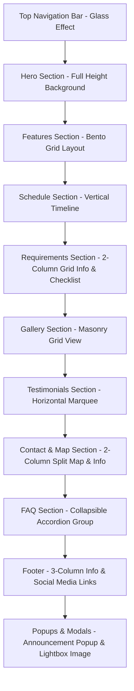

# Analisis Struktur Layout & Wireframe Landing Page PPDB Online

Dokumen ini berisi analisis detail per bagian (section-by-section) dari file view landing page utama: [app/Views/landing/index.php](file:///d:/ppdbv1/app/Views/landing/index.php). Dokumentasi ini dirancang agar mudah dipelajari untuk keperluan pengembangan frontend, pemetaan database (CMS), dan pemahaman susunan layout wireframe.

---

## Ringkasan Struktur Wireframe Halaman (Vertical Layout)

Halaman ini menggunakan arsitektur *Single Page Application (SPA)* semu dengan menu navigasi yang meluncur mulus (*smooth scroll*) ke masing-masing jangkar ID (`#`). Berikut adalah urutan tata letak komponen dari atas ke bawah:

---

## Analisis Detail Per Bagian Layout

### 1. Document Head & Styles
* **Lokasi File**: [app/Views/landing/index.php#L1-L94](file:///d:/ppdbv1/app/Views/landing/index.php#L1-L94)
* **Deskripsi Wireframe**: Area non-visual utama yang memuat data SEO, rel link stylesheet, font keluarga Google (*Plus Jakarta Sans* & *Material Symbols Outlined*), font ikon (FontAwesome 6.4.0), dan sanitasi input (DOMPurify).
* **Elemen Desain & Struktur CSS**:
  * Menggunakan scroll halus bawaan CSS browser (`scroll-smooth`).
  * CSS Kustom internal mendefinisikan perilaku visual khusus:
    * `.signature-gradient`: Gradien hijau emerald khas madrasah (`#006948` ke `#00855d`).
    * `.glass-nav`: Navbar transparan dengan efek buram latar belakang (`backdrop-filter: blur(20px)`).
    * `.marquee` & `.marquee-content`: Animasi CSS keyframe untuk menggerakkan testimonial secara horizontal tanpa henti.
    * Kustomisasi scrollbar dengan aksen warna emerald.
    * `.asymmetric-card`: Kartu dekorasi asimetris (sudut kiri atas tidak membulat).

---

### 2. Top Navigation Bar (Navbar)
* **Lokasi File**: [app/Views/landing/index.php#L97-L154](file:///d:/ppdbv1/app/Views/landing/index.php#L97-L154)
* **Deskripsi Wireframe**:
  * Bar horizontal melayang (*sticky navbar*) di bagian atas layar dengan batasan lebar konten `max-w-7xl` untuk visual yang rapi di layar lebar.
  * **Sisi Kiri**: Logo Sekolah (dinamis berupa gambar) dan Nama Sekolah. Jika gambar kosong, menampilkan inisial huruf pertama sekolah dalam lingkaran berlatar hijau primer.
  * **Sisi Tengah (Desktop)**: Menu navigasi teks (Beranda, Jadwal, Persyaratan, Kontak, Data Pendaftar).
  * **Sisi Kanan (Desktop)**: Tombol aksi sekunder ("Masuk" berupa teks polos) dan tombol aksi utama / Call to Action ("Daftar" berlatar gradien).
  * **Sisi Kanan (Mobile)**: Tombol hamburger menu (`#menu-btn`) dengan ikon Material Symbols yang berubah menjadi tanda "X" (close) saat menu dibuka.
  * **Mobile Menu Dropdown**: Menu vertikal tersembunyi yang muncul meluncur ke bawah dari dasar navbar pada perangkat mobile.
* **Variabel Data Dinamis (PHP)**:
  * `$content['navbar']['nama_sekolah']`: Nama madrasah yang tampil di teks brand.
  * `$web['logo_sekolah']`: Nama file gambar logo sekolah dari direktori `uploads/logo/`.
  * `$content['pendaftar']['is_visible']`: Flag biner (`'1'` atau `'0'`) untuk menentukan apakah menu tautan "Data Pendaftar" publik ditampilkan atau disembunyikan.
* **Layouting CSS & Responsive Grid**:
  * Flexbox (`flex justify-between items-center`) dengan pengkondisian responsif (`hidden md:flex` untuk menu tengah, `hidden sm:flex` untuk tombol masuk/daftar, `md:hidden` untuk tombol hamburger).
  * Ketinggian navbar tetap dengan padding vertikal (`py-4`).

---

### 3. Hero Section
* **Lokasi File**: [app/Views/landing/index.php#L156-L197](file:///d:/ppdbv1/app/Views/landing/index.php#L156-L197)
* **Deskripsi Wireframe**:
  * Komponen pembuka berukuran satu layar penuh (`min-h-screen`) yang menyajikan visual impresif pertama kepada pengunjung.
  * **Latar Belakang**: Gambar panorama/gedung sekolah yang ditimpa gradien emerald gelap ke transparan (`bg-gradient-to-br from-primary/90 via-primary/60 to-transparent`) agar teks putih di atasnya tetap terbaca dengan jelas (*contrast ratio* tinggi).
  * **Konten Tengah (Center-Aligned Layout)**:
    * Badge tahun ajaran dinamis dengan sudut bulat (*pill badge*).
    * Judul utama (`<h1>`) berukuran besar dan tebal (`text-4xl sm:text-5xl md:text-7xl font-extrabold`).
    * Subjudul pendukung berupa paragraf deskripsi singkat.
    * Barisan dua tombol aksi berdampingan: tombol utama "Daftar Sekarang" beraksen kuning/emas emas dengan bayangan bercahaya, dan tombol sekunder "Pelajari Persyaratan" dengan gaya semi-transparan (*glassmorphism outline*).
    * Indikator panah bawah yang memantul (*bounce animation*) sebagai pemandu visual ke konten di bawahnya.
* **Variabel Data Dinamis (PHP)**:
  * `$content['hero']['background_image']`: Path relatif gambar latar belakang hero.
  * `$content['hero']['headline']`: Judul promosi utama.
  * `$content['hero']['subheadline']`: Paragraf keterangan pengantar.
  * `$content['hero']['cta_link']`: Tautan tujuan tombol daftar (default ke registrasi).
  * `$content['hero']['cta_text']`: Label tulisan di tombol daftar utama.
* **Layouting CSS**:
  * Menggunakan CSS Flexbox kolom terpusat (`flex flex-col items-center justify-center text-center`) di dalam wadah pemosisian absolut/relatif (`relative z-10`).

---

### 4. Features Section (Bento Grid)
* **Lokasi File**: [app/Views/landing/index.php#L198-L229](file:///d:/ppdbv1/app/Views/landing/index.php#L198-L229)
* **Deskripsi Wireframe**:
  * Menampilkan poin-poin keunggulan sekolah menggunakan pendekatan layout kartu moderen.
  * **Header Bagian**: Judul bagian di tengah, garis aksen pembatas warna kuning emas, dan teks deskripsi singkat di bawahnya.
  * **Grid Layout**: Grid responsif dengan kartu-kartu asimetris. Setiap kartu memiliki ikon besar, judul keunggulan, dan penjelasan ringkas.
  * **Efek Hover**: Kartu berubah warna latar belakang secara mulus dari abu-abu terang ke hijau emerald primer, dengan transisi warna teks menjadi putih saat diarahkan kursor (*hover effect*).
* **Variabel Data Dinamis (PHP)**:
  * `$fitur`: Array objek data keunggulan sekolah dari database.
    * `$f['ikon']`: Class ikon FontAwesome (misal `fas fa-school`) atau nama ikon Material Symbols.
    * `$f['judul']`: Judul keunggulan.
    * `$f['deskripsi']`: Deskripsi detail keunggulan.
* **Layouting CSS & Responsive Grid**:
  * Menggunakan CSS Grid (`grid grid-cols-1 md:grid-cols-4 gap-6`). Kartu diatur melebar mengisi 2 kolom pada layar desktop (`md:col-span-2`), membentuk struktur grid bento 2x2 yang seimbang.

---

### 5. Schedule Section (Timeline)
* **Lokasi File**: [app/Views/landing/index.php#L230-L296](file:///d:/ppdbv1/app/Views/landing/index.php#L230-L296)
* **Deskripsi Wireframe**:
  * Alur tahapan waktu pendaftaran berbentuk garis lurus vertikal (*Vertical Timeline*).
  * **Garis Tengah**: Sebuah elemen garis vertikal abu-abu tipis di tengah halaman (pada desktop) atau di sisi kiri (pada mobile).
  * **Kartu Jadwal**: Kartu informasi yang ditempatkan secara berselang-seling (kiri-kanan pada layar desktop, atau sejajar ke kanan pada layar mobile).
    * Setiap kartu memiliki aksen garis warna vertikal tebal di sisi kiri sesuai status tahapnya (tahap 1 hijau, tahap 2 kuning, tahap 3 biru/kuning).
    * Titik lingkaran ikon penghubung (`.timeline-circle`) bertengger tepat di atas garis vertikal sebagai penunjuk visual.
* **Variabel Data Dinamis (PHP)**:
  * `$content['jadwal']['title']`: Judul bagian jadwal.
  * Tahapan 1 sampai 3 menggunakan data terstruktur:
    * `$content['jadwal']['tahap{N}_judul']`
    * `$content['jadwal']['tahap{N}_tanggal']`
    * `$content['jadwal']['tahap{N}_keterangan']`
* **Layouting CSS & Responsive Grid**:
  * Elemen garis vertikal menggunakan posisi absolut `:before` (`before:absolute before:left-5 md:before:left-1/2 before:w-0.5`).
  * Item menggunakan kombinasi arah flex responsif (`flex flex-row md:odd:flex-row-reverse`).
  * Lebar kartu diatur responsif (`w-[calc(100%-4rem)] md:w-[45%]`).

---

### 6. Requirements Section
* **Lokasi File**: [app/Views/landing/index.php#L297-L364](file:///d:/ppdbv1/app/Views/landing/index.php#L297-L364)
* **Deskripsi Wireframe**:
  * Layout terbagi rata menjadi 2 kolom vertikal berdampingan pada layar desktop.
  * **Kolom Kiri (Persyaratan Dokumen)**:
    * Judul bagian dan penjelasan pengantar.
    * Daftar persyaratan berupa list kartu kecil berurutan vertikal. Tiap item memiliki tanda centang hijau (`check_circle`) di sisi kiri, nomor syarat, dan detail dokumen pendaftaran.
    * Tombol opsional di bawah daftar untuk langsung menuju pencarian data pendaftar publik.
  * **Kolom Kanan (Visual Card Collage)**:
    * Layout kolase asimetris berisi 4 modul berbentuk grid 2x2 dengan tinggi dinamis.
    * Memadukan kartu gambar bertema pendaftaran dengan kartu informasi berwarna solid yang memuat petunjuk ringkas (misal: "Siapkan berkas asli saat verifikasi").
* **Variabel Data Dinamis (PHP)**:
  * `$content['syarat']['title']`: Judul bagian persyaratan.
  * `$content['syarat']["item{$i}"]`: Teks butir persyaratan (1 s.d. 6). Menggunakan array fallback `$defaultSyarat` jika data CMS kosong.
  * `$content['pendaftar']['is_visible']`: Cek izin publikasi tombol data pendaftar.
* **Layouting CSS & Responsive Grid**:
  * Struktur induk menggunakan grid responsif (`grid grid-cols-1 md:grid-cols-2 gap-16 items-center`).
  * Grid kolase gambar kanan menggunakan `grid grid-cols-2 gap-4` dengan offset atas untuk efek kedalaman kolom kedua (`pt-8`).

---

### 7. Gallery Section (Masonry Grid)
* **Lokasi File**: [app/Views/landing/index.php#L365-L393](file:///d:/ppdbv1/app/Views/landing/index.php#L365-L393)
* **Deskripsi Wireframe**:
  * Grid gambar dinamis menggunakan efek tata letak koran/majalah (*Masonry Layout*).
  * **Kartu Galeri**: Foto kegiatan dengan tinggi bervariasi yang mengalir menyesuaikan ruang kosong secara otomatis.
  * **Efek Hover Overlay**: Saat kursor menyentuh kartu, lapisan hijau emerald semi-transparan muncul menutupi gambar (`bg-primary/85 opacity-0 group-hover:opacity-100`), menampilkan ikon kaca pembesar zoom-in, judul foto, dan deskripsi singkat dengan animasi meluncur halus ke atas.
* **Variabel Data Dinamis (PHP)**:
  * `$galeri`: Array kumpulan gambar kegiatan dari database.
    * `$g['gambar']`: Path file gambar galeri.
    * `$g['judul']`: Judul dokumentasi kegiatan.
    * `$g['deskripsi']`: Deskripsi detail kegiatan.
* **Layouting CSS & Responsive Grid**:
  * Menggunakan kolom murni CSS (`columns-1 sm:columns-2 lg:columns-3 gap-6 space-y-6`) alih-center flex/grid konvensional untuk mempertahankan tinggi asli gambar tanpa terpotong (Masonry style).

---

### 8. Lightbox Modal
* **Lokasi File**: [app/Views/landing/index.php#L394-L407](file:///d:/ppdbv1/app/Views/landing/index.php#L394-L407)
* **Deskripsi Wireframe**:
  * Modal dialog tingkat atas (*Overlay Modal*) dengan latar belakang hitam pekat transparan (`bg-black/90`) dan z-index tinggi (`z-[100]`) untuk menampilkan gambar galeri ukuran penuh.
  * **Struktur Wadah**:
    * Tombol tutup melayang ("X") di sudut kanan atas layar.
    * Konten terpusat vertikal dan horizontal: Gambar utama diperbesar dibatasi tinggi maksimal viewport (`max-h-[75vh]`).
    * Kotak caption melayang semi-transparan di bagian bawah gambar yang menampilkan Judul dan deskripsi lengkap foto yang sedang aktif.
* **Kontrol JavaScript**:
  * Ditampilkan melalui fungsi `openLightbox()` dan disembunyikan menggunakan `closeLightbox()`, baik dengan mengeklik tombol tutup, mengeklik area luar gambar (overlay hitam), maupun menekan tombol `Escape` pada keyboard.

---

### 9. Testimonials Section (Marquee)
* **Lokasi File**: [app/Views/landing/index.php#L408-L448](file:///d:/ppdbv1/app/Views/landing/index.php#L408-L448)
* **Deskripsi Wireframe**:
  * Slider horizontal otomatis berlanjut tanpa akhir (*Infinite Horizontal Scrolling Marquee*).
  * **Efek Efemeral Sisi**: Efek pudar (*fade mask*) di sisi kiri dan kanan wadah untuk memberikan ilusi bahwa kartu meluncur keluar masuk secara halus.
  * **Struktur Kartu Testimonial**:
    * Ukuran lebar kartu tetap (`w-80 md:w-96`).
    * Ikon kutip besar transparan di sudut kanan sebagai ornamen pemanis.
    * Informasi Pemberi Ulasan: Avatar bulat (atau inisial nama jika avatar kosong), Nama, dan Peran (contoh: WALI MURID, ALUMNI).
    * Rating bintang (1 s.d. 5) dengan ikon bintang emas FontAwesome.
    * Paragraf ulasan bercetak miring (*italic*).
* **Variabel Data Dinamis (PHP)**:
  * `$testimoni`: Array data testimoni. Di-merge dua kali (`array_merge($testimoni, $testimoni)`) di backend PHP untuk menghasilkan duplikasi elemen agar efek animasi scroll mulus tanpa celah kosong saat berputar.
* **Layouting CSS & Animasi**:
  * Wadah luar diset menyembunyikan scrollbar (`overflow-hidden`).
  * Lapisan gradien pudar menggunakan posisi absolut kiri-kanan dengan CSS background linear gradient (`from-surface to-transparent`).
  * Animasi CSS `@keyframes scroll` memindahkan posisi sumbu X dari `0` ke `-100%` secara linier. Kecepatan diatur konstan `30s`. Keadaan animasi dijeda (*paused*) saat kursor pengguna berada di atas kartu ulasan.

---

### 10. Contact & Map Section
* **Lokasi File**: [app/Views/landing/index.php#L449-L516](file:///d:/ppdbv1/app/Views/landing/index.php#L449-L516)
* **Deskripsi Wireframe**:
  * Tata letak grid 2-kolom seimbang yang menggabungkan informasi hubung dan integrasi lokasi fisik.
  * **Kolom Kiri (Pusat Informasi)**:
    * Barisan detail kontak dengan ikon bulat berwarna latar hijau pudar yang berubah warna saat di-hover. Memuat Alamat Kampus, Email Resmi, dan WhatsApp Hotline.
    * Tombol kontak WhatsApp hijau lebar dengan ikon khas aplikasi di bagian bawah untuk akses instan (*Click to Chat*).
  * **Kolom Kanan (Google Maps)**:
    * Menampilkan frame Google Maps interaktif interaktif selebar kolom penuh. Jika data belum dikonfigurasi admin, otomatis menampilkan gambar peta placeholder abu-abu dengan pesan keterangannya.
* **Variabel Data Dinamis (PHP)**:
  * `$content['kontak']['alamat']`: Teks alamat fisik sekolah.
  * `$content['kontak']['whatsapp_nama']`: Nama narahubung WhatsApp panitia.
  * `$content['kontak']['whatsapp_number']`: Nomor WhatsApp tujuan chat instan (format internasional tanpa spasi).
  * `$content['kontak']['google_maps']`: Embed script iframe Google Maps dari Google.
* **Layouting CSS**:
  * Wadah utama diatur menggunakan grid responsif (`grid lg:grid-cols-2`) dengan sudut bulat tebal (`rounded-2xl`) dan border abu-abu tipis sebagai pembatas.

---

### 11. FAQ Section (Accordion)
* **Lokasi File**: [app/Views/landing/index.php#L517-L569](file:///d:/ppdbv1/app/Views/landing/index.php#L517-L569)
* **Deskripsi Wireframe**:
  * Daftar pertanyaan yang sering diajukan dengan mekanisme buka-tutup vertikal (*Accordion Panel*).
  * **Kartu FAQ**:
    * **Header Tombol**: Memuat teks pertanyaan tebal warna emerald dan ikon tanda panah kebawah (`expand_more`) di sisi kanan.
    * **Panel Jawaban**: Area di bawah tombol pertanyaan yang menyembunyikan teks jawaban secara default. Saat diklik, panel meluncur turun dan ikon panah berputar 180 derajat ke atas.
* **Variabel Data Dinamis (PHP)**:
  * `$faqs`: Array data pertanyaan dan jawaban dari database.
    * `$faq['pertanyaan']`: Teks pertanyaan bantuan.
    * `$faq['jawaban']`: Teks jawaban bantuan (mendukung line break paragraf otomatis menggunakan `nl2br`).
* **Kontrol JavaScript**:
  * Logika vanilla JS disematkan tepat di bawah loop FAQ. Mendengarkan aksi klik pada tombol FAQ untuk mengganti status kelas `hidden` dan memutar ikon panah pembuka.

---

### 12. Footer Section
* **Lokasi File**: [app/Views/landing/index.php#L570-L637](file:///d:/ppdbv1/app/Views/landing/index.php#L570-L637)
* **Deskripsi Wireframe**:
  * Blok penutup halaman berwarna hijau emerald sangat gelap (`bg-emerald-900`) dengan pembatas garis atas berwarna kuning tebal. Lebar konten dibatasi `max-w-7xl` dan terbagi menjadi 3 kolom utama pada desktop:
    * **Kolom 1 (Branding & Medsos)**: Logo sekolah kecil berlatar putih, nama sekolah, deskripsi visi singkat sekolah, serta jajaran tombol lingkaran ikon media sosial (Facebook, Instagram, TikTok, YouTube).
    * **Kolom 2 (Pintasan Link)**: Menu navigasi cepat link-link internal penting yang memiliki animasi bergeser ke kanan sedikit saat di-hover.
    * **Kolom 3 (Bantuan Teknis)**: Informasi kontak cepat tim IT untuk mengatasi kendala sistem, berupa kotak email terintegrasi.
  * **Copyright Bar**: Baris teks di bagian paling bawah footer yang dipisahkan oleh garis border tipis untuk keterangan hak cipta dan tahun berjalan.
* **Variabel Data Dinamis (PHP)**:
  * `$content['footer']['nama_sekolah']` atau `$content['navbar']['nama_sekolah']`: Nama instansi sekolah.
  * `$content['footer']['facebook_link']`, `instagram_link`, `tiktok_link`, `youtube_link`: URL media sosial resmi sekolah.
  * `$content['footer']['copyright']`: Teks lisensi hak cipta.
  * `$web['logo_sekolah']`: Path gambar logo.

---

### 13. Announcement Popup Modal
* **Lokasi File**: [app/Views/landing/index.php#L638-L729](file:///d:/ppdbv1/app/Views/landing/index.php#L638-L729)
* **Deskripsi Wireframe**:
  * Dialog modal melayang darurat (*Alert Modal*) yang muncul secara otomatis beberapa saat setelah halaman selesai dimuat.
  * **Struktur Modal**:
    * Area luar gelap blur (`fixed inset-0 bg-black/60 backdrop-blur-sm`).
    * Kotak pengumuman putih di tengah:
      * Bagian Kepala: Ikon toa promosi (`campaign`) dan judul pengumuman tebal.
      * Bagian Isi: Gambar lampiran opsional di bagian atas (jika ada), diikuti teks pengumuman yang mendukung scrollbar kustom jika teks terlalu panjang.
      * Bagian Kaki: Tombol "Tutup Dialog" dengan fitur teks hitung mundur (*countdown timer*).
* **JavaScript & Logic Timer**:
  * Variabel PHP `$popups` dikonversi ke JSON array JavaScript.
  * Fungsi `showPopup()` memuat data popup pertama secara berurutan.
  * Jika properti countdown diatur (misal `5` detik), tombol tutup akan berstatus dinonaktifkan (`disabled`, `cursor-not-allowed`) dan menampilkan teks detik tersisa. Setelah hitung mundur habis, tombol diaktifkan kembali.
  * Ketika tombol tutup diklik, modal disembunyikan dan sistem secara otomatis mengecek apakah ada pengumuman lanjutan dalam antrean untuk ditampilkan berikutnya.

---

## Logika Interaktivitas & Event Listener (JavaScript)

Bagian naskah kode JavaScript utama di akhir file ([app/Views/landing/index.php#L730-L823](file:///d:/ppdbv1/app/Views/landing/index.php#L730-L823)) melayani interaktivitas frontend sebagai berikut:

1. **Efek Scroll Navbar**:
   * Membaca posisi scroll layar (`window.scrollY`). Jika lebih besar dari 20px, kelas bayangan navbar bertambah tebal (`shadow-md`) untuk mempertegas pemisah antara navbar dengan konten di bawahnya.
2. **Toggle Menu Mobile**:
   * Mengatur buka/tutup menu navigasi mobile pada tombol hamburger. Mengubah ikon Material Symbols dari `menu` menjadi `close`.
3. **Smooth Anchor Scrolling**:
   * Mengambil semua tautan berjangkar (`a[href^="#"]`). Menghitung posisi koordinat elemen target dikurangi offset tinggi navbar tetap (`80px`), lalu meluncurkan animasi scroll halus (`window.scrollTo({ behavior: 'smooth' })`).
4. **Highlighting Menu Aktif**:
   * Memantau posisi vertikal layar saat digulir. Menghitung elemen section mana yang sedang berada di layar aktif, lalu secara otomatis menambahkan aksen garis kuning emas (`border-b-2 border-amber-400 pb-1`) pada teks tautan menu navbar yang sesuai.
